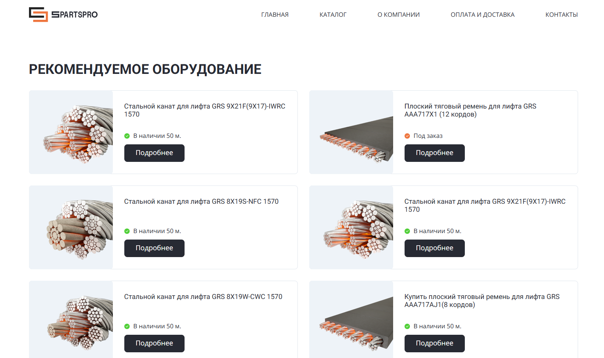

# SPARTSPRO (Vanilla JS)
Учебный проект части интернет-магазина по продаже лифтового оборудования

[Ссылка на сайт](https://necit-dev.github.io/spartspro-landing/)

## Стек технологий
- HTML5
- CSS3
- JavaScript(ES6+)

## Особенности
- **Адаптивный сайт** - корректно отображается на устройствах c viewport от 280px
- **Меню** - в мобильной версии навигация осуществляется по кнопке "меню"
- **Генерация карточек товара** - карточки товаров генерируются динамически с помощью JS (в будущем можно на основании данных с сервера генерировать)

## Запуск
1) Для локального запуска можно открыть index.html (все остальные файлы проекта должны лежать рядом), для этого можно клонировать данный проект
(если установлен git) или скачать *.zip* архив и распаковать.
Для дальнейшей разработки можно воспользоваться Live Server в VS Code или аналогом в WebStorm
2) Чтобы просто посмотреть сайт, достаточно перейти по ссылке выше
